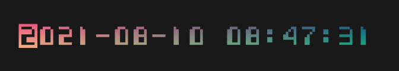

# kez

Bare-bones [OpenGL](https://www.opengl.org//) sprite renderer.

<div align="center"></div>

Needed things
---
*   [Nix](https://nixos.org/download.html)

Quick start
---
```
$ nix-shell
[nix-shell:path/to/kez]$ ./scripts/run.sh
```

Attribution
---
| Source | Author | Assets |
| --- | --- | --- |
| [ascii-bitmap-font-futuristic](https://opengameart.org/content/ascii-bitmap-font-futuristic) | [@domsson](https://opengameart.org/users/domsson) | `assets/charmap-futuristic_black.png`, `assets/charmap-futuristic_white.png` |
| [16x12-terminal-bitmap-font](https://opengameart.org/content/16x12-terminal-bitmap-font) | [@CruzR](https://opengameart.org/users/cruzr) | `assets/pixfont-bold.png`, `assets/pixfont.png` |
